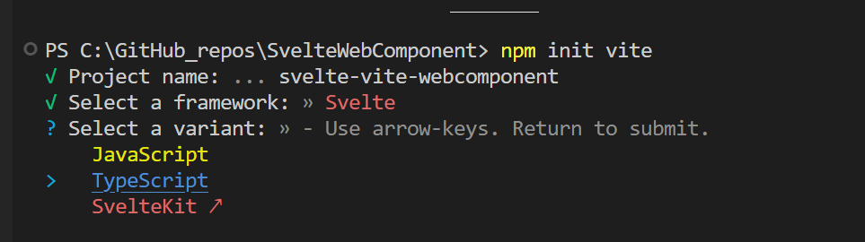
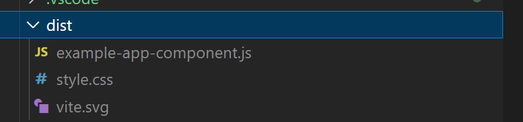
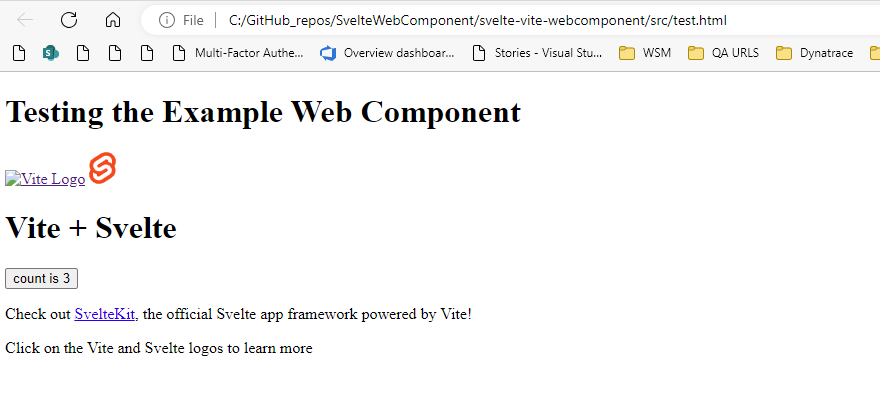

# Inspiration for the project
I wanted a way to create a web component using a declarative javascript language that had a light framework. I could then embed this web component on any site since the web component is language agnostic.

Svelte seemed like a great use case since it doesn't have a javascript runtime like React and Angular; it compiles into vanilla html and javascript and doesn't rely on a virtual DOM. I can then use a static file server for a CDN to host the like AWS S3/Cloudfront or Azure Blob Storage/ Accelarate Content Delivery to host the bundled javascript web component.

I tool inspiration from the following people however they used Rollup to accomplish it and Svelte recommends use the latest templates which use Vite 
1.  Matias Meno - Inspiration for wrapping Svelte in an Standard Web Component https://www.colorglare.com/svelte-components-as-web-components-b400d1253504
2. Li Hautan - Explained how to  https://www.youtube.com/@lihautan

# How to get started
Create the scaffolding -I used the `npm init vite command`
This template should help get you started developing with Svelte and TypeScript in Vite.

Then ran `npm install` to install the depedencies

# How to Test the App
1. When you want to test the App's rendering you can you the hot reload rendering, run in the terminal `npm run dev` - this takes advantage of the SvelteKit's capabilities but does not support testing if a web component renders okay (Shadom DOM, CSS issues, etc.).

2. However if you want to test the rendering of the web component, you need to do something different. This will simular the javascript file hosted on the CDN
       
    A.)      I setup a test page callend test.html which will simulate rendering the web component on a web page
    B.) To build the component using Vite I edited the file to output the javascript file in the dist folder. You need to run in the terminal `npm run build`. You can see the output below

    C.) I add a entry in the package.json to open the web component. Run in the terminal `npm run test:web-component`

TODO - as you can see in the image below you can see the css wasn't included. The shadow root causes issues with styles and if you hosted a global stylesheet on the CDN that's another network hop to retrieve that component. Here's an example article on how to solve the problem. https://www.colorglare.com/css-resets-and-global-styles-in-web-components-c71fcea86dbd  
